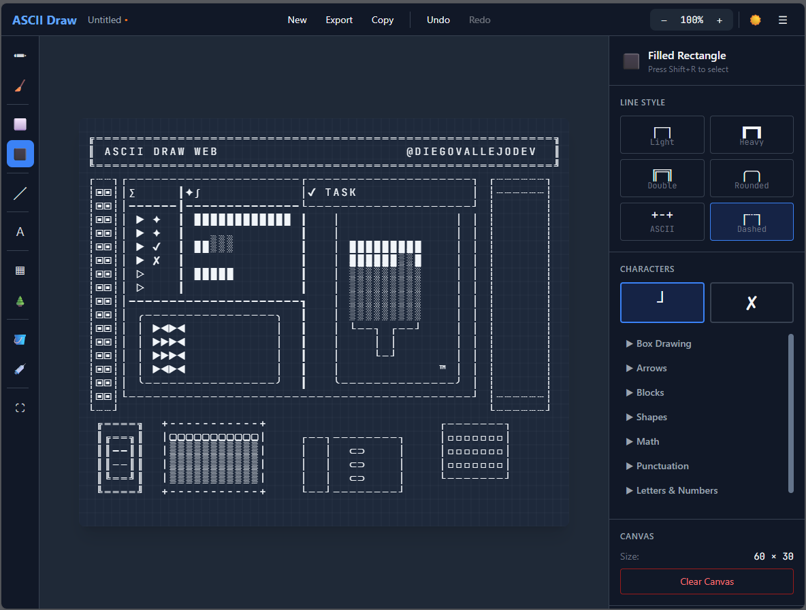

<div align="center">
  <h1>✏️ ASCII Draw Web</h1>
  
  <p>
    <strong>Create beautiful diagrams and artwork using ASCII characters — right in your browser</strong>
  </p>
  
  <p>
    <a href="#features">Features</a> •
    <a href="#demo">Demo</a> •
    <a href="#getting-started">Getting Started</a> •
    <a href="#usage">Usage</a> •
    <a href="#contributing">Contributing</a> •
    <a href="#acknowledgments">Acknowledgments</a>
  </p>
  
  <p>
    
    
    
    
  </p>
  
  <br/>
  
  
</div>

---

## 🌟 About

**ASCII Draw Web** is a modern, browser-based ASCII art editor that brings the power of character-based drawing to the web. This project is a TypeScript/React port of the excellent [ASCII Draw](https://github.com/Nokse22/ascii-draw) by [Nokse22](https://github.com/Nokse22), originally built as a GTK4/Python desktop application for Linux.

Whether you're creating technical diagrams, flowcharts, documentation visuals, or creative ASCII art, ASCII Draw Web provides an intuitive interface with professional tools — no installation required.

### Why a Web Version?

- 🌐 **Cross-platform** — Works on Windows, macOS, Linux, and mobile devices
- 🚀 **Zero installation** — Just open your browser and start creating
- 💾 **Local-first** — Your work stays in your browser, with easy export options
- 📱 **Responsive** — Full touch support for tablets and mobile devices
- 🔄 **Always up-to-date** — No manual updates needed

---

## ✨ Features

### 🛠️ Comprehensive Tool Set

| Tool                 | Description                                                 | Shortcut       |
| -------------------- | ----------------------------------------------------------- | -------------- |
| **Rectangle**        | Draw rectangles with multiple line styles                   | `Ctrl+R`       |
| **Filled Rectangle** | Rectangles with customizable border/fill characters         | `Ctrl+Shift+R` |
| **Line**             | Cartesian, freehand, and stepped lines with optional arrows | `Ctrl+L`       |
| **Freehand Brush**   | Natural drawing with adjustable brush sizes                 | `Ctrl+F`       |
| **Text**             | Plain text and stylized FIGlet fonts                        | `Ctrl+T`       |
| **Table**            | Professional table formatting with multiple styles          | `Ctrl+B`       |
| **Tree View**        | Hierarchical tree structures from indented text             | `Ctrl+Y`       |
| **Eraser**           | Variable-size eraser tool                                   | `Ctrl+E`       |
| **Flood Fill**       | Fill areas with chosen characters                           | `Ctrl+Shift+F` |
| **Select/Move**      | Selection with move, rotate, copy, and delete               | `Ctrl+M`       |
| **Character Picker** | Pick characters directly from the canvas                    | `Ctrl+P`       |

### 🎨 Line Styles

Choose from multiple box-drawing character sets:

```
┌─────────┐  ┏━━━━━━━━━┓  ╔═════════╗  ╭─────────╮  +---------+
│  Light  │  ┃  Heavy  ┃  ║ Double  ║  │ Rounded │  |  ASCII  |
└─────────┘  ┗━━━━━━━━━┛  ╚═════════╝  ╰─────────╯  +---------+
```

### ⚡ Additional Features

- **Undo/Redo** — Full history support with `Ctrl+Z` / `Ctrl+Shift+Z`
- **Zoom & Pan** — Navigate large canvases with ease
- **Dark/Light Theme** — Easy on the eyes, day or night
- **Export Options** — Copy to clipboard or download as `.txt`
- **Responsive Design** — Works on desktop, tablet, and mobile
- **Keyboard Shortcuts** — Efficient workflow for power users
- **Offline Support** — Works without an internet connection (PWA)

---

## 🎮 Demo

**[Try ASCII Draw Web →](https://your-username.github.io/ascii-draw-web)**

> _No signup required. Start drawing immediately!_

---

## 🚀 Getting Started

### Prerequisites

- [Node.js](https://nodejs.org/) 18.0 or higher
- [npm](https://www.npmjs.com/) or [pnpm](https://pnpm.io/)

### Installation

```bash
# Clone the repository
git clone https://github.com/your-username/ascii-draw-web.git

# Navigate to the project directory
cd ascii-draw-web

# Install dependencies
npm install

# Start the development server
npm run dev
```

Open [http://localhost:5173](http://localhost:5173) in your browser.

### Build for Production

```bash
# Create optimized production build
npm run build

# Preview production build locally
npm run preview
```

---

## 📖 Usage

### Basic Drawing

1. **Select a tool** from the left toolbar
2. **Click and drag** on the canvas to draw
3. **Left-click** uses the primary character, **right-click** uses the secondary
4. **Adjust settings** in the right sidebar for the active tool

### Keyboard Shortcuts

| Action            | Shortcut       |
| ----------------- | -------------- |
| Undo              | `Ctrl+Z`       |
| Redo              | `Ctrl+Shift+Z` |
| Copy to Clipboard | `Ctrl+C`       |
| New Canvas        | `Ctrl+N`       |
| Save              | `Ctrl+S`       |
| Open              | `Ctrl+O`       |
| Zoom In           | `Ctrl++`       |
| Zoom Out          | `Ctrl+-`       |
| Reset Zoom        | `Ctrl+0`       |

### Exporting Your Work

- **Copy to Clipboard** — Click the copy button or press `Ctrl+C`
- **Download as Text** — Use `File → Save As` or `Ctrl+S`
- **Share** — Paste directly into code comments, documentation, or chat

---

## 🏗️ Project Structure

```
ascii-draw-web/
├── src/
│   ├── components/       # React components
│   │   ├── Canvas/       # Main drawing canvas
│   │   ├── Toolbar/      # Tool selection bar
│   │   ├── Sidebar/      # Tool options & character picker
│   │   └── Header/       # App header & menus
│   ├── tools/            # Drawing tool implementations
│   ├── core/             # Canvas state, history, primitives
│   ├── store/            # Zustand state management
│   ├── hooks/            # Custom React hooks
│   ├── types/            # TypeScript type definitions
│   ├── constants/        # App constants & configurations
│   └── utils/            # Utility functions
├── public/
│   └── fonts/            # FIGlet font files
├── tests/                # Test files
└── docs/                 # Documentation & screenshots
```

---

## 🧪 Testing

```bash
# Run all tests
npm test

# Run tests in watch mode
npm run test:watch

# Generate coverage report
npm run test:coverage
```

---

## 🤝 Contributing

Contributions are welcome! Whether you're fixing bugs, adding features, or improving documentation, your help makes ASCII Draw Web better for everyone.

### How to Contribute

1. **Fork** the repository
2. **Create** your feature branch (`git checkout -b feature/amazing-feature`)
3. **Commit** your changes (`git commit -m 'Add some amazing feature'`)
4. **Push** to the branch (`git push origin feature/amazing-feature`)
5. **Open** a Pull Request

### Development Guidelines

- Follow the existing code style (ESLint + Prettier)
- Write tests for new features
- Update documentation as needed
- Keep commits atomic and well-described

### Ideas for Contributions

- [ ] Additional FIGlet fonts
- [ ] More line/border styles
- [ ] Image-to-ASCII conversion
- [ ] Collaborative editing
- [ ] Custom color themes
- [ ] Plugin system for custom tools

---

## 🙏 Acknowledgments

### Original Project

This project is a web-based port of **[ASCII Draw](https://github.com/Nokse22/ascii-draw)** by **[Nokse22](https://github.com/Nokse22)**.

> _ASCII Draw is a powerful and intuitive GTK4/Python application that lets you draw diagrams, tables, tree views, art and more using only characters._

We are deeply grateful to Nokse22 for creating such an excellent open-source tool and for licensing it under GPL-3.0, which made this port possible.

**If you enjoy this web version, please also [star the original project](https://github.com/Nokse22/ascii-draw)!** ⭐

### Built With

- [React](https://react.dev/) — UI framework
- [TypeScript](https://www.typescriptlang.org/) — Type-safe JavaScript
- [Vite](https://vitejs.dev/) — Build tool
- [Zustand](https://github.com/pmndrs/zustand) — State management
- [Tailwind CSS](https://tailwindcss.com/) — Styling
- [Figlet.js](https://github.com/patorjk/figlet.js) — ASCII text rendering
- [Vitest](https://vitest.dev/) — Testing framework

---

## 📄 License

This project is licensed under the **GNU General Public License v3.0** — see the [LICENSE](LICENSE) file for details.

---

## 🔗 Links

- **Live Demo**: Coming soon...
- **Original Project**: [https://github.com/Nokse22/ascii-draw](https://github.com/Nokse22/ascii-draw)
- **Report Bug**: [GitHub Issues](https://github.com/DiegoVallejoDev/ascii-draw-web/issues)
- **Request Feature**: [GitHub Issues](https://github.com/DiegoVallejoDev/ascii-draw-web/issues)

---

<div align="center">
  <p>
    <sub>Inspired by <a href="https://github.com/Nokse22/ascii-draw">ASCII Draw</a> by <a href="https://github.com/Nokse22">Nokse22</a></sub>
  </p>
</div>
